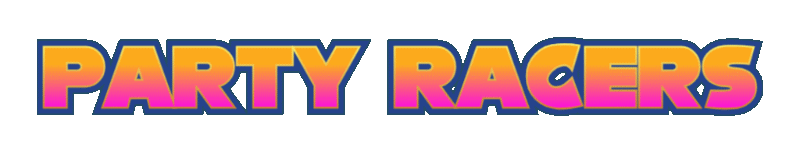

    
  </a>

A fork of [Dr. Robotnik's Ring Racers](www.kartkrew.org/) and [radioracers](https://github.com/blondedradio/RadioRacers), making several tweaks to the game balance to make it a more chaotic experience for those who find the vanilla game to be either too hard or not quite to their tastes. The codebase was merged with radioracers, so all QoL additions and changes from that build are available here, as well.
Updated for version 2.4.

## Links

- [Kart Krew Dev Website](https://www.kartkrew.org/)
- [Kart Krew Dev Discord](https://www.kartkrew.org/discord)
- [SRB2 Forums](https://mb.srb2.org/)

## Features

-18 new items, original and returning from Xitem mods from SRB2Kart.

* Adjustments to several mechanics, nerfs and buffs, and some new things...

* Invincibility buffed, Grow buffed, stun nerfed, and more.

* Shields now demonstrate their elemental properites a bit more. For example, try to avoid water when using a Fire Shield.

* CHECK warnings now appear sooner. There are new CHECK warnings, as well.
* Insta-whip charges a little faster and drains rings much slower.
* EXP item lockout is gone, so use any item you can to win the race.
* You can now item spy opponent Ring Box slots.
* Speed Assist is removed.
* Sonic Booms are now completely consistent regardless of your positioning - no more needing to keep track of your speed and distance from 1st place to guess if you'll make it through a tripwire. 1st place still isn't really allowed to pass through them without an item, though.
* Items are no longer filtered by what the game thinks you need - you have access to all items at all times based on your distance from 1st place.
* Several MRs have been integrated, fixing some bugs, exposing more aspects of the game to lua, and allowing CPUs to use Ballhog!

There's a lot more... Check out the changelog included with the assets for a full list, along with descriptions and tips on how to use the new items!

## Disclaimers
* Online is largely untested. Any issues can be reported here, and anyone willing to assist with issues regarding it are welcome to share their findings and/or solutions. Netcoding isn't my strongest area of expertise.
* Battle mode is also thus untested, as a direct result.

## How To Use

* Get the [latest copy](www.kartkrew.org) of Dr. Robotnik's Ring Racers installed on your computer.
* Download the assets needed for this build [here](https://github.com/supercoolsonic/PartyRacers/releases/tag/InitialRelease).
* Make a copy of the Ring Racers install folder.
* Extract the assets into the directory of the copy of the install of Ring Racers.
* Leave the radioracer assets in the folder alongside the .exe, and overwrite the other three assets in the 'data' folder.
* Compile the build, and place the ringracers_party.exe into the folder, and remove the vanilla .exe.
* Run the ringracers_party.exe to play.

## Credits
Butler Hyudoro sprites: modifications by YKJavi, original Hyudoro sprites by VelocitOni

Original Fancy Hyudoro mod here: https://mb.srb2.org/addons/fancy-hyudoros.8370/

Checker Wrecker: item made by Ashnal, sprites by Raivolt and Mr. Logan

Original Checker Wrecker mod here: https://mb.srb2.org/addons/the-checker-wrecker.5730/

Master Emerald: item made by RetroStation, sprites by Mitsuo.

Original Master Emerald mod here: https://mb.srb2.org/addons/master-emerald.5123/

Ring Gun, Egg Blaster, and Chameleon Blaster: original items made by RetroStation, Chameleon Blaster and its sounds are from Seventh Sentinel (credit to TehRealSalt, who's the lead programmer for that game), energy blast graphics by Velocit Oni

Original Eggsplosive Depot mod here: https://mb.srb2.org/addons/eggsplosive-depot.6041/

Armageddon Shield: item by DoMikoto ツ

Original mod here: https://srb2workshop.org/resources/armageddon-shield-item.172/

Time Stone: sprites by Mr. Logan, mod by JugadorXEI.

Original Time Travel mod here: https://mb.srb2.org/addons/time-travel.5860/

Mega Chopper: from Battle Plus by Snu. Touched-up sprites by me.

Original Battle Plus mod here: https://mb.srb2.org/addons/srb2kart-battle-plus-kl_bp-v2-0-pk3.2350/

Pressure Mine: sprites by ArtoMeister

Original Lethal Landmine mod here: https://mb.srb2.org/addons/lethal-landmine-a-mine-reskin.6291/

Custom Sprites for Double Banana, Triple Banana, Quad Banana, Double Sneakers, Triple Sneakers, and Dual Jawz by Spee, Jin, and Momphi, originally used in Sunflower's Garden/Saturn/Blankart. Small modifications by me.

Saturn Build here: https://github.com/Indev450/SRB2Kart-Saturn

Blankart Build here: https://codeberg.org/NepDisk/blankart